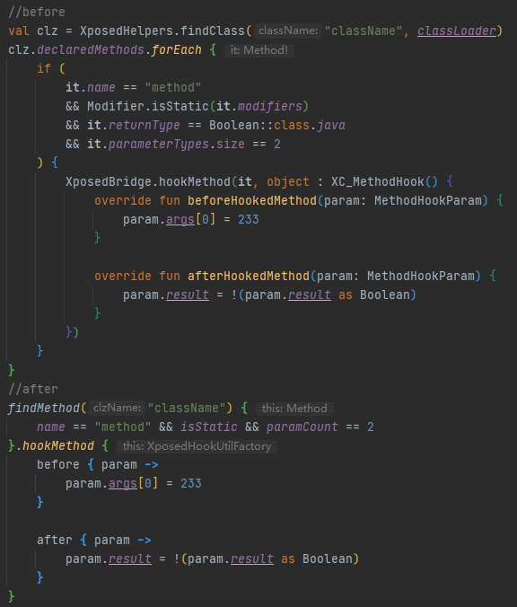

# EzXHelper
    
一个使Xposed模块开发变的更轻松的kotlin库    
当前最新版本:1.0.3

### 注意事项

**大量扩展/Top-Level 函数/属性警告**

**本库依旧处于开发过程中，你可能会遇到包括但不限于以下问题：**

- 出现八哥
- 函数名称、参数变动

**较大变动：**

- 0.5.0版本更改了部分函数命名，比如`findXxxByCondition`一律改成了`findXxx`，并且参数也进行了修改，更新到此版本时请注意修改。
- 0.7.1版本更改了方法、构造的调用参数类型，请将原来的`arrayOf()`函数替换成`args()`以及`argTypes()`。
- 0.7.5版本将`minSdkVersion`从 21 提升至 **24** 。
- 0.9.2版本再次修改部分函数名字，比如`getXxxByClassOrObject`一律改成了`xxx`，变得简短了，同时将`ReflectUtils.kt`
  拆分为多个部分，且移除了一些不必要的扩展属性/函数。

## 使用方式

在build.gradle的dependencies下添加语句 `implementation 'com.github.kyuubiran:EzXHelper:1.0.3'`   
调用`EzXHelperInit.initHandleLoadPackage(lpparam)`初始化 就可以使用大部分工具类啦

### 例子

### 功能

- 方法查找(通过条件、Descriptor等查找)
- 属性查找(通过条件、Descriptor等查找)
- 各种扩展属性(如Member 可以直接判断是否公开、私有、静态等)
- 各种扩展函数(如可以直接用Class.newInstance调用有参构造实例化对象 obj.invokeMethod调用成员方法 obj.getObject获取对象等)
- 资源注入(使用宿主的context时 也能使用模块的资源)
- 在宿主内以宿主的身份启动模块(未注册)的Activity

### 使用本库的项目

|                                   项目名称                                    | 项目介绍                                                                                              |
|:-------------------------------------------------------------------------:|:--------------------------------------------------------------------------------------------------|
|        [Template](https://github.com/KyuubiRan/ezxhepler-template)        | EzXHelper模板                                                                                       |
|          [QAssistant](https://github.com/KitsunePie/QAssistant)           | 兼具实用与美观于一身的 QQ 小帮手                                                                                |
|            [QQCleaner](https://github.com/KyuubiRan/QQCleaner)            | 瘦身模块                                                                                              |
|        [HideMyApplist](https://github.com/Dr-TSNG/Hide-My-Applist)        | 隐藏应用列表                                                                                            |
|          [OneText](https://github.com/lz233/OneText_For_Android)          | A neat little application that can display some custom sentences through widgets on the launcher. |
|           [XAutoDaily](https://github.com/LuckyPray/XAutoDaily)           | XAutoDaily 是一个兼容QQ大部分版本的开源签到 Xposed 模块                                                            |
|             [QAuxiliary](https://github.com/cinit/QAuxiliary)             | QAuxiliary 是一个基于 QNotified 的开源 Xposed 模块                                                          |
|                   [TMoe](https://github.com/cinit/TMoe)                   | TMoe 是一个兼容若干第三方开源 Telegram 客户端的开源 Xposed 模块                                                       |
| [FuckCoolapk R](https://github.com/Xposed-Modules-Repo/org.hello.coolapk) | Fuck Coolapk Again                                                                                |
|    [WooBox For MIUI](https://github.com/Simplicity-Team/WooBoxForMIUI)    | 一个基于 MIUI13(Android 12) 适配的自定义工具                                                                  |
| [WooBox For ColorOS](https://github.com/Simplicity-Team/WooBoxForColorOS) | 一个基于 ColorOS12(Android 12) 适配的自定义工具                                                               |
|            [MiuiHome](https://github.com/qqlittleice/MiuiHome)            | 针对 Miui 桌面的自定义扩展                                                                                  |
|             [TwiFucker](https://github.com/Dr-TSNG/TwiFucker)             | Yet Another Adkiller for Twitter                                                                  |

### 捐赠支持
如果你喜欢这个项目，且想要通过捐赠的方式支持我，可以通过以下渠道：
- [爱发电](https://afdian.net/a/kyuubiran)
