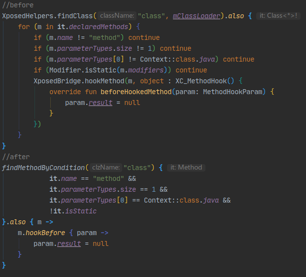

# EzXHelper
一个使Xposed模块开发变的更轻松的kotlin库    
当前最新版本:0.0.4
## 使用方式
在build.gradle的dependencies下添加语句implementation 'com.github.kyuubiran:EzXHelper:0.0.4'
调用EzXHelperInit.initHandleLoadPackage(lpparam)初始化 就可以使用大部分工具类啦
### 例子

### 使用本库的项目
[QNotifiedX](https://github.com/QNotifiedX/QNotifiedX)    
[QQCleaner](https://github.com/KyuubiRan/QQCleaner)
